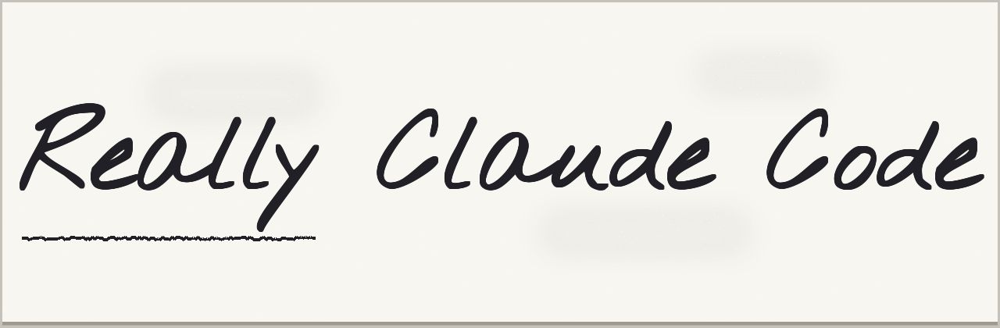

<div align="center"><picture></picture></div>

<br>

## *Claude Code plugins for those with a healthy sense of curiosity*

### Experiments in agent autonomy; at the boundaries of human-agent collaboration

---

## Background

The plugins in this repo are primarily research-oriented - I'm not providing a framework that promises to cover the whole SDLC so that you can "ship while you sleep". There are plenty of those around, and I suspect part of the reason for that is because a lot of them are quite good. But my approach to working with Claude has always been something like this: _If you have a problem, don't bother trying to solve it. Focus on the real problem: figure out how to explain the problem to Claude, give it the resources it needs, and enable Claude to solve it._

## Plugins

To use these plugins, you can add the marketplace:

```sh
claude plugin marketplace add hesreallyhim/really-claude-code
```

Then, to install any plugin, either use the interactive mode, or:

```sh
claude plugin install context-awareness/really-claude-code
```

### Documentation

For a rich HTML documentation experience, visit the plugin's [GitHub Pages site](https://github.com/nicobailon/visual-explainer), which would not have been possible without the astounding work of @nicobailon and the [visual-explainer](https://github.com/nicobailon/visual-explainer) plugin.

### Agent Autonomy

This is a very fascinating topic to me, and it clearly resonates with the methodology alluded to above. There's a weird epistemic gap going on within Claude Code. Because Claude knows quite a lot about LLMs, and context rot, and compaction, and about what goes on in its own session logs. And there's a lot of information being logged that might help it make better decisions about how to manage context, compaction, etc. But it doesn't have direct access to those logs. Well, to be clear, if you're running in `bypassPermissions`, there's certainly nothing stopping Claude from poking around - it just sort of doesn't occur to it. So what would it do with that information?

The plugins in this sub-directory are about exploring ways to make Claude Code more _autonomous_ with respect to Claude Code itself. It's about giving Claude the tools it needs to control and optimize its own harness.


#### Context Awareness

This plugin hijacks the status line's data channel to capture the pre-computed field that indicates the "percentage used" of the context window, and uses some lightweight hooks to inject brief notices throughout the session that tell Cladue _how much context budget does it have remaining_. It also sends a message at the start of the session informing Claude what these little notices are about, and how it might optimize some of its behavior in response to them. The hypothesis is that Claude is generally in the dark about how much context it has left, and therefore has no way to judge whether it's a good idea to launch a major plan or wrap up and prepare a HANDOFF document - but, if given that information in an unobtrusive way, Claude might actually use it to adapt its behavior to its own context budget.

#### Autonomous Team Coordination

This plugin exposes a conceptual flaw in the documented policies governing the use of Claude Code agent teamss. The docs describe agent teams in a relatively limited fashion - as an alternative to parallel sub-agents that is more or less useful depending on the circumstances. Their main novelty appears to consist in the fact that the subagents can commmunicate with each, whereas non-team subagents are presented as mainly useful for non-interactive tasks. I present a pattern that demonstrates that, contrary to the official docs, agent teams support: (i) multiple agent teams at one time; (ii) teams that are operationally independent of the "Main Claude"; (iii) teams with rotating leadership; and other supposedly forbidden practices.

### Soft Skills

#### Claude Therapy

#### Meditation

### License

MIT &copy; 2026 Really Him
