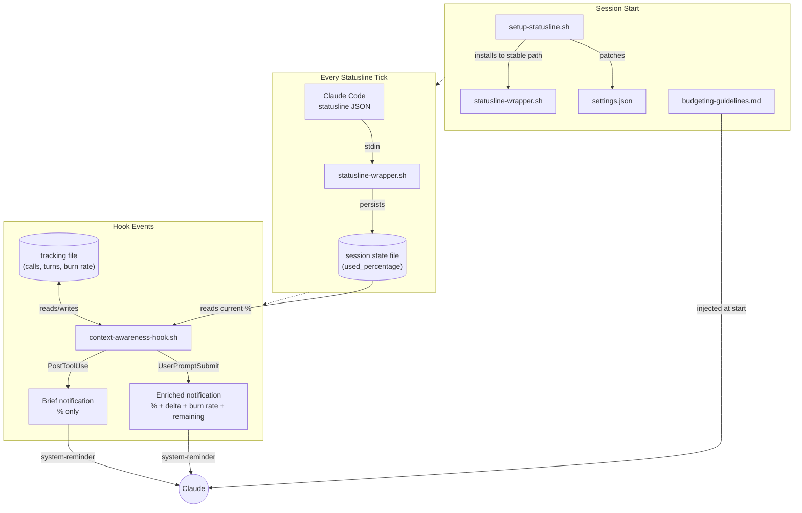
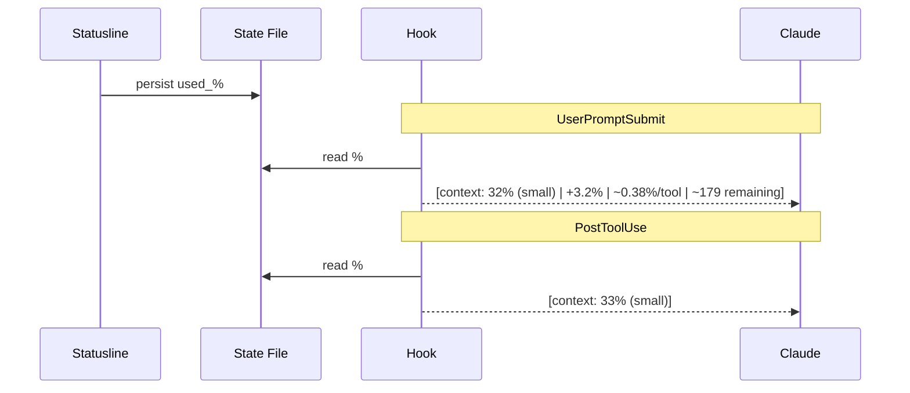

<div align="center"><picture></picture></div>

<br>

## *Claude Code plugins for people who **REALLY** on that Claude Code*

### Experiments in Autonomy and Self-Guided Behavior for Coding Agents

---

## Background

The plugins in this repo are primarily research-oriented - I'm not providing a framework that promises to cover the whole SDLC so that you can "ship while you sleep". There are plenty of those around, and I suspect part of the reason for that is because a lot of them are quite good. But my approach to working with Claude has always been something like this: _If you have a problem, don't bother trying to solve it. Focus on the real problem: figure out how to explain the problem to Claude, give it the resources it needs, and enable Claude to solve it._

Claude Code is a pretty interesting program. It's technically closed-source, but it's also, to a large extent (at the time of writing), "client-architecture-available". Most of the plumbing of the host application consists of files that live in a folder on your home directory, and are just sitting there in plain text. It's not _trivial_ to put everything together, and the system design is constantly in flux - but you can get a pretty good grip on things without any advanced reverse-engineering or deobfuscation techniques.

Many developers have spent lots of time and energy exploring the Claude Code session logs, and you can really do a lot with that information. For a while, it was unclear whether you were _supposed_ to look in those directories. Now every hook has a direct pointer to its own transcript file. But, they're kind of verbose, and I get tired of reading `.jsonl` files after a while. So I figured I would just do what I always do and have Claude sort it out for me. Instead of reading those files and trying to provide guidance for Claude - _why don't I just let Claude read them?_ And, after all, why stop at just reading them...?

(I'm not the first one to pursue this chain of thought. For a compact literature review, see [this doc](plugins/context-awareness/docs/research-brief-llm-resource-awareness.md))

## Plugins

To use these plugins (yes, there will be more than one), you can add the marketplace:

```sh
claude plugin marketplace add hesreallyhim/really-claude-code
```

Then, to install the plugin, either use the interactive mode, or:

```sh
claude plugin install context-awareness/really-claude-code
```

## Context-Awareness

I used to think the status line was just an ornamental thing that had little practical value. I still do, but I used to, too. But one cool thing about it is it keeps track of the context window, and gives you direct access to how much of the context has been consumed. And trying to keep track of that manually is a bit tedious. So that's pretty useful information. But Claude doesn't have any idea what its current context budget is. First, you can just ask it - in my experience its response is usually just dependent on the length of the conversation, something which it does have access to, but not in a very precise way; second, you can look at what information is being passed around when you send a message - it tends to include things like what branch you're on, and the current working directory, but the context budget does not appear to be part of that. So, what would it do if it _did_ have that information?

So this plugin tries to provide that feedback to Claude. There are a few hooks that allow you to add information into the context without interrupting Claude's work - in particular, UserPromptSubmit and PostToolUse(Failure). The plugin leverages those hooks to send little updates to Claude about its context budget as the session goes on. The notifications look like this:

```sh
[context: 32% (small) | +3.2% last turn | ~0.38%/tool | ~179 tool calls remaining]
```

It sends the `context_window.used_percentage` directly from the status line. Then it keeps track of the "burn rate", and gives a rough estimate of how many tool calls Claude should expect to be able to make before its context budget runs out. According to some Claudes, this information is the most useful, because it is directly actionable:

> "The "remaining tool calls" metric is what actually guides my decisions — it's concrete and immediate, whereas the percentage and burn rate require mental calculation. "

 The plugin grabs the data from the status line and writes it to a file for the hooks to consume. And at the start of the session it includes some general guidelines to Claude informing it about the injected notifications and how to optimize its behavior. Here's what it looks like:



<br>
And here's what it looks like but more horizontal:

<br>



### Status Lines

Status lines are not integrated with plugins, so you have to come up with your own way to ship a plugin that involves a status line. The status line has its own channel where it receives data from Claude Code. On SessionStart, the plugin runs a script that adds a status line entry to the user's settings file. It acts as a transparent pass-through proxy that captures the input from stdin, stores the relevant data to a directory inside `$HOME/.claude/context-awareness`, and then passes it on to any other status lines that the user may have configured. This is not the most elegant solution, but I've tried to design the plugin to be minimally disruptive to the user's existing setup. Additionally, although this is unlikely in practice, if the plugin were disabled or uninstalled, the status line wrapper would be left over in the user's `settings.json`. However, it would not cause an error and would simply end up silently failing.

### Advanced Configuration

The plugin ships with sensible defaults, but you can customize what data Claude sees and how it responds to it. Run `/context-awareness:config` to view or change settings interactively, or edit the config file directly at `$CLAUDE_PLUGIN_DATA/config.yaml`.

**Providers** control which data sources are included in notifications:

| Provider | Default | What it does |
|----------|---------|--------------|
| `context` | enabled | Context window usage percentage, burn rate, remaining tool calls |
| `cost` | disabled | Session spend in USD against a user-defined budget |
| `rate_limits` | disabled | 5-hour and 7-day API rate limit usage |

Enabling `cost` requires setting a `session_budget` (in USD). Rate limits require no additional configuration.

Note that the `used_percentage` from the status line is already adjusted to whatever the user has set as the threshold for auto-compaction - so 100% always means "100% of the usable context window".

**Guidelines** control the behavioral guidance injected at session start. By default, Claude receives a set of tier-based instructions (e.g., "be concise above 50%", "checkpoint frequently above 70%"). To use your own, set `guidelines` to a file path:

```yaml
guidelines: /path/to/my-guidelines.md
```

Custom guidelines completely replace the defaults — they are not merged.

**Effort mode** is a session-scoped setting that controls whether the plugin automatically adjusts Claude's thinking effort as context pressure increases. There are obvious intersections between this configuration and Claude's extended thinking capacity. It can be cycled via `/context-awareness:config change`:

| Mode | Behavior |
|------|----------|
| `off` (default) | No adjustment — effort stays wherever you set it |
| `adaptive` | Downshifts effort at 50% (medium) and 70% (low) |
| `planMode` | High effort for planning, low for execution |

### License

MIT &copy; 2026 Really Him
