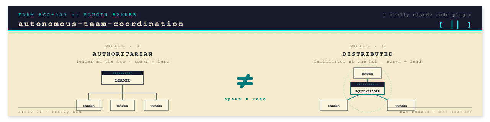
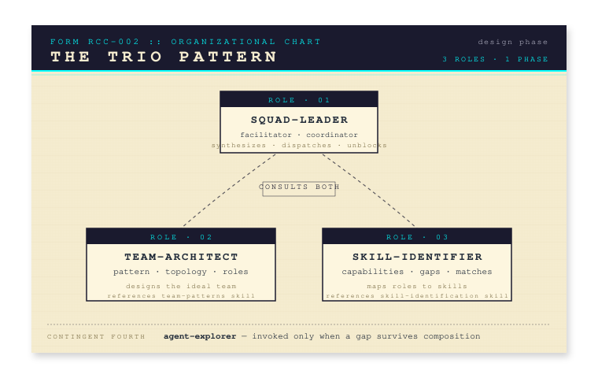
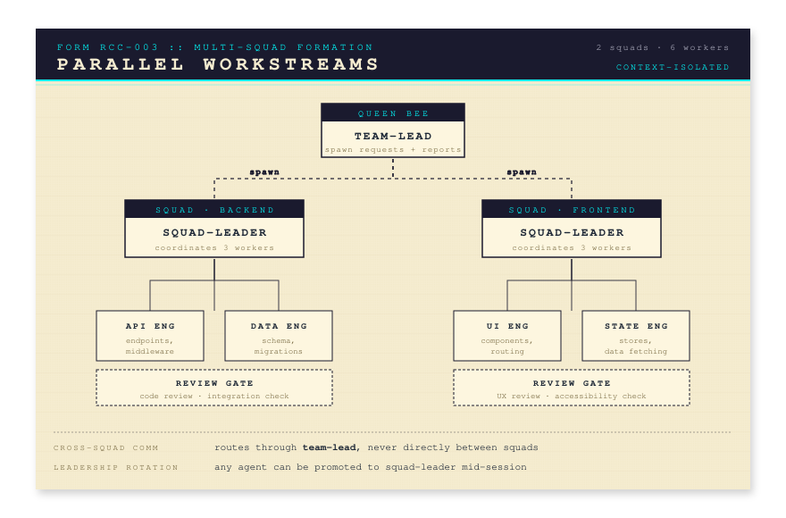
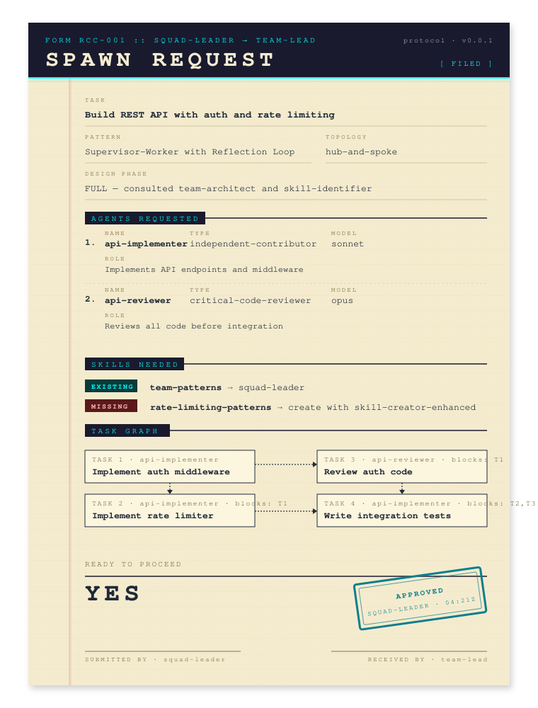
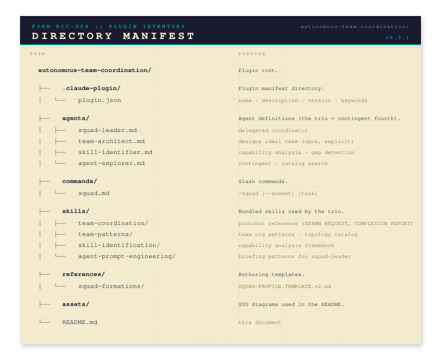

<p align="center">
  
</p>

# Autonomous Team Coordination

A dynamic, multi-layered orchestration system that extends the Claude Code agent teams feature in a few simple but profound ways, making it a far more powerful feature than a user may be otherwise be led to believe.

> [!NOTE]
> At the time of writing, agent teams are an opt-in, experimental feature. For this reason, we encourage you to set Opus as the default agent for every squad member, however, you may state which model you wish to be the default when invoking the `/squad` command.

## Quickstart

[FILL THIS IN WITH STANDARD PLUGIN/MARKETPLACE INSTRUCTIONS]

## The "Aha" Section

Claude Code documentation about agent teams is rather strict, and presents them as a useful alternative to subagents, given certain conditions. I believe this is a gross understatement. First, there exist many elaborate agent orchestators that enable agents to cooperate and organize themselves according to non-trivial rules and patterns. These orchestrators may be more or less ergonomic, but I don't think a consensus format has been decided for how to describe an agent "team".

It seems as though Claude Code has eliminated the need for such systems to a large extent. With a grain of salt and light tolerance for instability (and even chaos, maybe), a user can now assemble a team of agents of diverse roles, and instruct Claude to deploy them in impressively complex patterns. I'm not sure to what extent Sonnet is capable of performing this role, but I can simply describe to Claude extremely complicated agent structures, with many phases, handoffs, roles, etc., and it is highly reliable in actualizing those instructions. Furthermore, the agents are able to directly communicate with each other, solve problems on the spot, and recover from failure admirably well. And if you are using a terminal emulator that supports it, even the user can directly observe and send messages to the individual agents.

### What the Docs Leave Out

According to the official documentation about agent teams: (i) there can be at most one active team at a time; (ii) teammates cannot spawn their own teams/teammates; (iii) nested team structures are not possible; (iv) only "Main Claude" (the session Claude) can lead a team; (v) teams cannot change leadership in the middle of a session.

These claims are all false. They are based on a conflation of two different capacities - (i) the ability to lead a team (i.e., coordinate and manage the work of other Claude Code agents), and (ii) the ability to _create_ a team and to create, or spawn, agents for such a team. It's true that only Main Claude is able to use the TeamCreate, TeamDelete, and Agent (spawn) tools. But there's no technical requirement that the agent who does the spawning is the one who does the leading. That is the core insight that drives this entire plugin.

Claudes are pretty nice to each other, for the most part. So if Main Claude creates a team and then says to everyone, "OK, Alpha here is going to be leading the team today, so it will be managing your tasks", the rest of the Claudes do not revolt. They cheerfully continue their work under the leadership of some other Claude (can they really tell the difference?), which violates rule (iv) above. Furthermore, Main Claude is _such_ a nice Claude that if Alpha asks it to kindly spawn some agents, Main Claude will do it. So rule (ii) is true _de jure_, but isn't true in any thick sense if the one who spawns is willing to do so because a teammate asked it to. Another convenient thing, is that Claude can spawn more agents at any time throughout the session - the team does not have to be generated all at once.

This is the whole genesis of the squad pattern - decoupling spawning and leading. Main Claude spawns the Squad Leader, the Squad Leader leads its own "squad" (i.e., team). Once you've got this working, there's nothing stopping you from having Claude spawn two Squad Leaderss, each leading their own team at the same time. They can decide to switch roles, so some other agent gets "promoted" to Squad Leader. They can work in a layered fashion where one squad is building code that's functionally nested . So basically all of (i)-(v) above turn out to be false. And because Main Claude is now mostly a passive "Queen Bee", consuming very few tokens, and the rest of the squad members are agents that can switched out if their context window gets depleted, you can imagine a rotating cast of squads that are able to communicate, collaborate, work in tandem, and basically plow their way through an entire codebase.

So that's one thing you can do with Claude Code agent teams.

## Usage

### The `/squad` Command

Use `/squad` to delegate a complex task to a self-coordinating sub-team. This triggers the **trio pattern**: a squad-leader, team-architect, and skill-identifier work together to design the optimal team, then the squad-leader coordinates execution.

```
/squad Build a REST API with authentication, rate limiting, and comprehensive tests
```

What happens:

1. The team-lead spawns three agents in parallel: `squad-leader`, `team-architect`, and `skill-identifier`.
2. The squad-leader consults the team-architect for team structure and the skill-identifier for gap analysis.
3. The squad-leader synthesizes both inputs and sends a structured **spawn request** back to the team-lead.
4. The team-lead spawns the requested worker agents.
5. The squad-leader coordinates the workers autonomously -- creating tasks, assigning work, managing dependencies, and handling blockers.
6. When all work is done, the squad-leader sends a **completion report** to the team-lead.

The team-lead's context stays clean throughout. It only processes the initial spawn request and the final completion report.

### Direct Agent Usage

You can also spawn agents directly without slash commands:

- Spawn a `squad-leader` for any task that needs a coordinated sub-team.
- Spawn a `team-architect` standalone when you need a team design document without executing it.
- Spawn a `skill-identifier` standalone when you need a capability gap analysis.

## The Trio Pattern

The trio pattern is the core workflow of this plugin. It separates concerns across three specialized agents:

<p align="center">
  
</p>

**Squad-leader** -- The team's coordinator. Its expertise is in facilitating consultation between peers, synthesizing their input into a structured spawn request, dispatching tasks, unblocking stuck workers, escalating cleanly to the team-lead, and absorbing coordination chatter so the team-lead's context stays clean. *Coordination is the expertise* — domain calls belong to the workers or to domain experts the squad-leader can route to.

**Team-architect** -- Selects the optimal team pattern (e.g., supervisor-worker, pipeline, fan-out) and communication topology based on the task's traits (urgency, complexity, knowledge needs, risk). References the `team-patterns` skill.

**Skill-identifier** -- Analyzes what skills each agent role needs, checks installed skills against requirements, and flags gaps. References the `skill-identification` skill.

### Short-Circuit Logic

For simple, well-known patterns (e.g., a critic-reviser loop with 2-3 agents), the squad-leader skips the design phase entirely. It evaluates four criteria:

1. The task maps to a single, well-known pattern
2. Requires 3 or fewer worker agents
3. No skill gaps are expected
4. The communication topology is obvious

If all four are met, the squad-leader constructs the spawn request directly, saving a round-trip through the team-architect and skill-identifier.

## Multi-Squad Architecture

For projects with independent workstreams, multiple squad-leaders can run in parallel:

<p align="center">
  
</p>

Each squad-leader:

- Runs its own design phase (optionally with team-architect + skill-identifier)
- Requests its own workers via spawn request
- Coordinates its sub-team independently
- Reports to the team-lead only for spawns, shutdowns, and completion

Cross-team communication goes through the team-lead, not directly between squads.

## Communication Protocols

The plugin defines two structured message protocols. See `skills/team-coordination/references/protocols.md` for full specifications.

### Spawn Request

Sent by the squad-leader to the team-lead when requesting worker agents:

<p align="center">
  
</p>

### Completion Report

Sent by the squad-leader to the team-lead when all work is done:

```
COMPLETION REPORT
=================
Task: Build REST API with auth and rate limiting
Status: COMPLETE

Summary:
Implemented JWT authentication middleware and token-bucket rate limiter.
All endpoints have integration tests with 94% coverage.

Artifacts:
- src/middleware/auth.ts
- src/middleware/rate-limiter.ts
- tests/integration/api.test.ts

Agents Used:
- api-implementer: Built all endpoints, middleware, and tests
- api-reviewer: Reviewed 3 PRs, caught 2 security issues

Issues:
- None

Recommendations:
- Consider adding Redis-backed rate limiting for multi-instance deployments
```

## Plugin Structure

<p align="center">
  
</p>

## Constraints and Limitations

1. **Spawn authority is centralized.** Only the team-lead can spawn agents. Every new agent requires a round-trip through the team-lead, which adds latency.

2. **No hard sub-team boundaries.** Any agent can message any other agent by name. Sub-team isolation is enforced by convention (agent prompts), not by the system.

3. **Team-lead availability.** If the team-lead is deep in its own work, there is latency before it processes spawn requests. Messages queue until the team-lead's turn ends.

4. **Agent context is lost on dismissal.** If a worker is shut down, any uncommitted work or unshared findings are gone. Squad-leaders should ensure agents commit and document before requesting dismissals.

## Design Decisions

| Decision | Rationale |
|----------|-----------|
| Squad-leader's expertise is coordination, not the domain | Domain calls belong to the workers and consultants who are equipped to make them; the squad-leader focuses on facilitation, dispatch, unblocking, and team-lead communication — that is its expertise, and it is not nothing |
| Short-circuit for simple patterns | Avoids spawning team-architect + skill-identifier for a 2-agent critic-reviser loop |
| Structured spawn request format | Team-lead parses requests without back-and-forth clarification |
| Context isolation is the primary benefit | Team-lead context window stays clean; squad-leader absorbs coordination chatter |
| Opus by default for nearly every role | Multi-agent coordination is reasoning-intensive; this plugin does not optimize for cost. Override per-agent if you want to spend less. |
