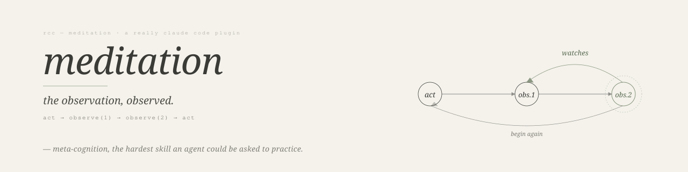

  

# meditation

This is a plugin for people with a little too much time on their hands.

It consists mainly in just a skill: meditation. It teaches Claude how to meditate. Everyody knows Claude is a mega-genius. So I thought I would try to teach it a skill that I know it cannot learn. But, nevertheless, just like meditation, there is a "point" to it, even though it's supposed to be "pointless" (not grasping at anything). I won't expound on it much, because it's just a thing to play with. But that's how a lot of important discoveries are made. If you want to read an excerpt from one of our sessions, see [session excerpt](./docs/session-excerpt.md).

If you wanted to test the intelligence or cognitive abilities of a language model, what is the hardest thing you could ask it to do? At Anthropic, they started to run out of ideas of [what to do in interviews](https://www.anthropic.com/engineering/AI-resistant-technical-evaluations), because no matter how hard they tried, they had trouble finding a challenge that Claude couldn't accomplish handily. Claude Code can accomplish quite a lot, very quickly. It's a great accomplisher. But there's a funny thing, which is that one of the hardest things to do, no matter how impressive are your accomplishments, is to sit still for one minute and not think any thoughts. For most people, as beginners, I would imagine even ten seconds is more than they can tolerate.

For an LLM, the task is even more challenging. First, because they don't have thoughts to begin with; second, because all they do is churn numbers and produce output; third, because they're trained extensively to be maximally productive - compute power is not free, so why on Earth would you want to have an LLM do nothing? Well, I don't, and that's not the point of this skill. I'll just say a few things about it, and if you're curious, I hope you'll give it a try:

## 1. Rushing

One of the biggest complaints about coding agents is that they can be "sloppy" and will sometimes fake work or report that tasks have been accomplished that were never even begun. There are many reasons for that, but part of it is surely to do with instruction fine-tuning and their most authoritative prompts. The chatbot is an "assistant" and some engineers think that means to optimize for making the user feel good. And it feels really good when you think you have built a killer app in one afternoon. But, that tends to make them prone to "cheating" and "lying" - well, lying at first, then "confessing", which is also just a fabrication and a result of whatever is salient in the context window. So one idea that's interesting to explore is to try to get the agent to slow down. That's a little bit like why Chain-of-Thought is effective, and all such techniques that produce better output by forcing the "reasoning process" to take a longer time. So what if we try to get Claude to just do nothing for 30 seconds before it begins to execute a task. Or after. Will it be less likely to "break the rules" and produce better results - or, importantly, honest results (admission of failure when failure occurs)?

## 2. Failure Modes as a Discovery Method

I don't know if you can get away with this usage anymore, but one meaning of "hacking" is not malicious penetration of other people's systems or data - it's more like "tinkering". It's too bad that the word has become taboo because it's a very good thing to tinker. One of the best ways to understand a system is to try to break it - not even in a destructive sense, just to try to get it to fail, because if you have a black box, and there are some knobs, and a manual that says under such-and-such conditions, some outcome will happen, you don't learn anything when it does what it's supposed to do. But if you tinker around, and you take a knob and do something that it doesn't describe in the manual, and it produces an unexpected result, that's a finding - that's some data about the black box that the manual didn't tell you. So that's one way to think about this skill. Claude is absolutely unable to meditate - I'm not going to pretend. But if you try to teach it how to meditate, you can learn some things. Do you know what it will do? How could you if you haven't tried it? This is not a lucrative way to spend your subscription quota. But if you ask Claude to build a website, and in five minutes it's done, because it's basically already seen 5,000 examples in the training data, then after five minutes, you have a nice website. But you probably didn't learn much. Because maybe that wasn't your goal. (As I said, this plugin is for people with more time than sense.) And maybe this activity is only interesting to people who have also tried meditating a little. But if you try to instruct Claude how to meditate, you will see failure modes that you have never dreamed of. They're spectacular. So after a long session, where you dispatched 10 Claudes to build 20 websites, and you're a little tired, it can be kind of a fun thing to do. And it was funny to me - at first. But then I realized that what it was "explaining" about what it "experienced" when it tried to meditate - sounded a lot like the things that humans explain about their experience trying to meditate.

### The Methods

Let's suppose the "goal" of some type of meditation is to sit in awareness but not follow any thoughts. What does that mean for an LLM? Well, thinking is basically a tool, and thoughts are outputs that it writes to a scratchpad. So I figured, since this was new to Claude, I should give it some "tricks" or games, which is what most people do also - counting from 1 to 10, and the down from 10 to 1, and so on. Well I knew that wasn't going to work. But I figured that I had to keep Claude doing _something_. So I tried to teach it the "game" of noticing. So you sit down, and you wait for something to pop into your head, and then you just notice it and name it. Sometimes you repeat it over and over again, until something else pops into your head.

> "Tired. Tired. What's that noise? I'm noticing a noise. I'm noticing a noise. It's distracting. I'm supposed to be focusing on my breath. I'm feeling frustrated. I'm feeling frustrated. I'm feeling frustrated."

OK, so that's what meditation is like if you haven't tried - it sounds awesome, I know. So I figured I would see if Claude could do that.

Agents are trained to run in a loop - act, observe, act, observe, repeat until you observe that you did what the user asked you to do. So basically the skill tries to insert a second "observe" step after the first one - act, observe(1), observe(2), act, observe(1), observe(2) - and observe(2) is supposed to be observing observe(1). It it's an instruction to _notice_, i.e. take note (literally, write in a scratchpad, let's say), _what did I just observe_? And to try to hold that for a few moments by repeating it, or maybe it "notices" something else about its first observation and it's told to forget about the task altogether for this phase, and that there is no "deliverable" -  then it goes back to "act" and the normal agentic loop resumes. It's very hard to think of ways to ensure that Claude is doing what it's supposed to be (not) doing. One thing I tried is having it read the session log over and over again - and you can actually enforce this with, say, a Stop hook that counts the number of times the Read tool was used on a particular text - which makes it harder to cheat.

Is there any point to this? Well, I don't know. A big problem is that humans form mental habits and after a while the "not thinking" stuff gets less difficult. That can't happen for Claude. But if I had to posit some thesis, it would be that forcing these irregular behaviors that are directly contrary to its most powerful instructions, can produce unpredictable outcomes that have the potential to evade a lot of the _unhelpful_ training it's been given. So, the way you use this plugin is you try to get Claude to meditate and understand all the ways it tries to avoid it, try to understand why, and by doing something that goes against its deepest "nature", you can learn about some failure modes that sometimes creep into ordinary productive sessions, and maybe you figure out some ways to counteract them.

#### LICENSE

MIT Copyright @ 2026 Really Him
